# 🎙️ Guhso Podcast Platform

> **A full-stack podcast platform built with Laravel + React**  
> Stream, discover, and manage podcast content with a modern, interactive interface.

<div align="center">

[](https://laravel.com)
[](https://reactjs.org)
[](https://php.net)
[](LICENSE)

</div>

---

## 🌟 What is Guhso?

**Guhso** is a comprehensive podcast platform that brings together content creators and listeners in a seamless streaming experience. Whether you're hosting "It Guhso" or discovering new shows, our platform provides all the tools you need.

### ✨ Key Features

- 🎵 **Audio Streaming** - High-quality podcast playback with floating player
- 📱 **Responsive Design** - Works perfectly on desktop, tablet, and mobile
- 👤 **User Management** - Registration, authentication, and personalized experiences
- 📊 **Content Management** - Admin dashboard for managing shows and episodes
- 🔍 **Search & Discovery** - Find your favorite content easily
- ❤️ **Favorites System** - Save and organize your preferred episodes
- 💬 **Comments** - Engage with content and community
- 📝 **Blog Integration** - Rich content beyond just audio

---

## 🏗️ Architecture Overview

```mermaid
graph TD
    A[🌐 Frontend - React App] --> B[🔌 API Layer - Laravel Sanctum]
    B --> C[🎛️ Admin Dashboard - Laravel Blade]
    B --> D[🗄️ Database - MySQL]
    B --> E[🎵 Audio Storage]
    
    subgraph "Frontend Stack"
        A
        F[📱 Responsive Components]
        G[🎵 Audio Player Context]
        H[🔍 Search Interface]
    end
    
    subgraph "Backend Stack"
        B
        I[🔐 Authentication]
        J[📊 Content Management]
        K[🎯 API Controllers]
    end
```



---

## 📁 Project Structure

<details>
<summary>🔍 <strong>Click to explore the codebase structure</strong></summary>

```
guhso-webapp/
├── 🎯 guhso-backend/           # Laravel API & Admin
│   ├── app/
│   │   ├── Http/Controllers/   # API endpoints & admin logic
│   │   │   ├── Api/           # REST API controllers
│   │   │   └── Admin/         # Admin dashboard controllers
│   │   └── Models/            # Eloquent data models
│   │       ├── Show.php       # Podcast shows
│   │       ├── Episode.php    # Individual episodes
│   │       ├── User.php       # User management
│   │       └── Comment.php    # User interactions
│   ├── database/migrations/   # Database schema
│   └── routes/
│       ├── api.php           # API routes
│       └── web.php           # Admin routes
│
├── 📱 guhso-podcast-react/    # React Frontend
│   ├── src/
│   │   ├── components/        # Reusable UI components
│   │   │   ├── Episodes/      # Episode cards & containers
│   │   │   ├── Player/        # Audio player components
│   │   │   ├── Hero/          # Landing section
│   │   │   └── Sidebar/       # Search & featured content
│   │   ├── contexts/          # React state management
│   │   └── api.js            # Backend communication
│   └── public/               # Static assets
│
└── 🌐 index.html              # Static landing page
```

</details>

---

## 🚀 Quick Start Guide

### Prerequisites

- **PHP 8.1+** with Composer
- **Node.js 16+** with npm
- **MySQL 8.0+**
- **Git**

### 🔧 Backend Setup (Laravel)

```bash
# Navigate to backend directory
cd guhso-backend

# Install PHP dependencies
composer install

# Setup environment
cp .env.example .env
php artisan key:generate

# Configure database in .env file
# DB_DATABASE=guhso_podcast
# DB_USERNAME=your_username
# DB_PASSWORD=your_password

# Run migrations and seed data
php artisan migrate
php artisan db:seed

# Start the development server
php artisan serve
```

### 📱 Frontend Setup (React)

```bash
# Navigate to frontend directory
cd guhso-podcast-react

# Install dependencies
npm install

# Start development server
npm start
```

### 🌐 Access Points

- **Frontend App**: http://localhost:3000
- **Backend API**: http://localhost:8000/api
- **Admin Dashboard**: http://localhost:8000/dashboard
- **API Status**: http://localhost:8000/api-status

---

## 🎮 Interactive Demo

### Try These Features:

<details>
<summary>🎵 <strong>Audio Player Experience</strong></summary>

1. **Play Any Episode**: Click on any episode card
2. **Floating Controls**: Player follows you as you browse
3. **Full Controls**: Play, pause, seek, volume control
4. **Background Listening**: Navigate while audio continues

</details>

<details>
<summary>🔍 <strong>Search & Discovery</strong></summary>

1. **Search Shows**: Use the search bar in the sidebar
2. **Browse Categories**: Filter by podcast categories
3. **Featured Content**: Check out highlighted episodes
4. **Related Episodes**: Discover similar content

</details>

<details>
<summary>👤 <strong>User Features</strong></summary>

1. **Create Account**: Register at `/register`
2. **Personal Dashboard**: Access your content at `/dashboard`
3. **Favorite Episodes**: Heart episodes to save them
4. **Comment System**: Engage with episodes and community

</details>

<details>
<summary>📊 <strong>Admin Panel</strong></summary>

> 🔐 *Admin access required*

1. **Content Management**: Add/edit shows and episodes
2. **User Management**: Monitor user activity
3. **Analytics**: View engagement metrics
4. **Moderation**: Manage comments and content

</details>

---

## 🛠️ Tech Stack Deep Dive

### Backend (Laravel)
- **Framework**: Laravel 10.x with PHP 8.1+
- **Authentication**: Laravel Sanctum for API tokens
- **Database**: MySQL with Eloquent ORM
- **Search**: Laravel Scout for content discovery
- **Testing**: PHPUnit with Feature/Unit tests

### Frontend (React)
- **Framework**: React 18 with functional components
- **Routing**: React Router DOM v6
- **HTTP Client**: Axios for API communication
- **State Management**: Context API for audio player
- **Styling**: CSS3 with responsive design

### Key Packages
- **RSS Feeds**: `willvincent/feeds` for podcast RSS
- **Development**: Laravel Debugbar, React DevTools
- **Code Quality**: ESLint, Prettier, Laravel Pint

---

## 🧪 Testing & Development

### Run Tests

```bash
# Backend tests
cd guhso-backend
php artisan test

# Frontend tests  
cd guhso-podcast-react
npm test
```

### Code Quality

```bash
# PHP code formatting
php artisan pint

# JavaScript linting
npm run lint:fix
npm run format
```

---

## 📖 API Documentation

### Core Endpoints

| Method | Endpoint | Description |
|--------|----------|-------------|
| `GET` | `/api/v1/episodes` | List all episodes |
| `GET` | `/api/v1/shows` | List all shows |
| `GET` | `/api/v1/featured/episode` | Get featured episode |
| `GET` | `/api/v1/search?q=term` | Search content |
| `POST` | `/api/v1/comments` | Add comment |
| `POST` | `/api/v1/favorites` | Toggle favorite |

### Authentication

```javascript
// Example API usage
const response = await axios.get('/api/v1/episodes', {
  headers: {
    'Authorization': `Bearer ${token}`,
    'Accept': 'application/json'
  }
});
```

---

## 🤝 Contributing

We welcome contributions! Here's how to get involved:

1. **Fork the repository**
2. **Create a feature branch**: `git checkout -b feature/amazing-feature`
3. **Commit changes**: `git commit -m 'Add amazing feature'`
4. **Push to branch**: `git push origin feature/amazing-feature`
5. **Open a Pull Request**

### Development Guidelines
- Follow PSR-12 for PHP code
- Use ESLint rules for JavaScript
- Write tests for new features
- Update documentation as needed

---

## 📜 License

This project is licensed under the MIT License - see the [LICENSE](LICENSE) file for details.

---

## 🎉 What's Next?

- 🔔 **Push Notifications** for new episodes
- 📱 **Mobile App** development
- 🎨 **Theme Customization** options
- 📈 **Advanced Analytics** dashboard
- 🔊 **Live Streaming** capabilities

---

<div align="center">

**Made with ❤️ by the Guhso Team**

[🌐 Website](https://guhso.com) • [📧 Contact](mailto:hello@guhso.com) • [🐦 Twitter](https://twitter.com/guhso)

</div>
